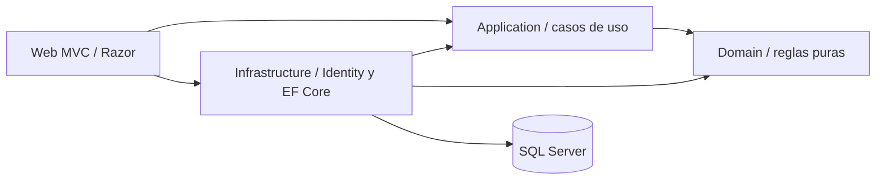

# Arquitectura

Se utiliza un monolito modular en capas para mantener un despliegue sencillo sin mezclar dominio, persistencia y presentación.

- **Domain**: entidades, estados, normalización y reglas puras; no depende de ASP.NET ni EF.
- **Application**: DTOs, resultados tipados, paginación y contratos asíncronos.
- **Infrastructure**: SQL Server, Identity, configuraciones Fluent API, seed y servicios.
- **Web**: controladores delgados, Razor, autenticación, antifalsificación y políticas.

Las fechas se guardan en UTC. Las cantidades usan `decimal(18,3)`, suficiente para inventarios con fracciones de milésima y sin los errores binarios propios de `float`.
