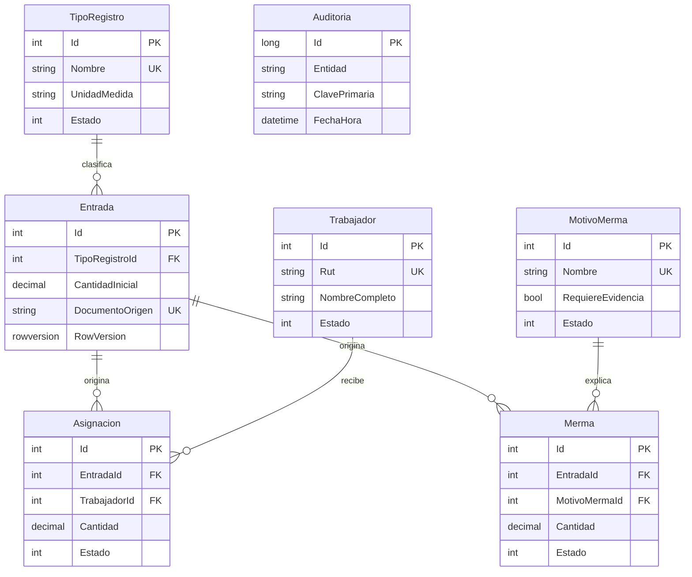

# Modelo de datos

La migración inicial crea restricciones `CHECK`, claves foráneas restrictivas, `rowversion` e índices únicos para RUT, nombres de catálogo y `(DocumentoOrigen, TipoRegistroId)`. Los movimientos están modelados en Sprint 1 para estabilizar el esquema; sus casos de uso se entregan en los siguientes sprints.

