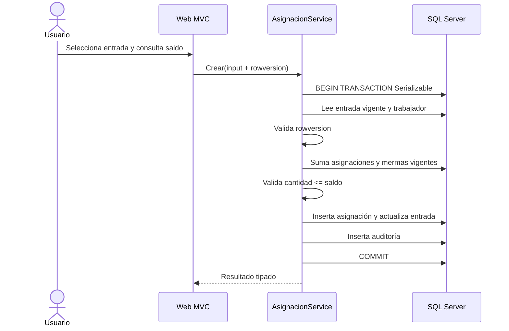

# Sprint 2: entradas, asignaciones y saldo

## Objetivo

Permitir registrar entradas y asignar cantidades a trabajadores sin sobrepasar el saldo, manteniendo trazabilidad y consistencia ante operaciones concurrentes.

## Flujo de asignación



## Definición central de saldo

`CantidadInicial - AsignacionesVigentes - MermasVigentes`

`SaldoService` y las proyecciones de consulta ejecutan los agregados en SQL. El valor mostrado por JavaScript es informativo; la confirmación siempre recalcula dentro de la transacción.

## Comandos de verificación

```powershell
dotnet tool run dotnet-ef migrations has-pending-model-changes `
  --project src/SistemaGestion.Infrastructure `
  --startup-project src/SistemaGestion.Web
dotnet build SistemaGestion.slnx
dotnet test SistemaGestion.slnx
dotnet run --project src/SistemaGestion.Web
```

No se agregó una migración vacía: el modelo físico de movimientos ya se creó en Sprint 1 y EF confirmó que no existen cambios pendientes.

