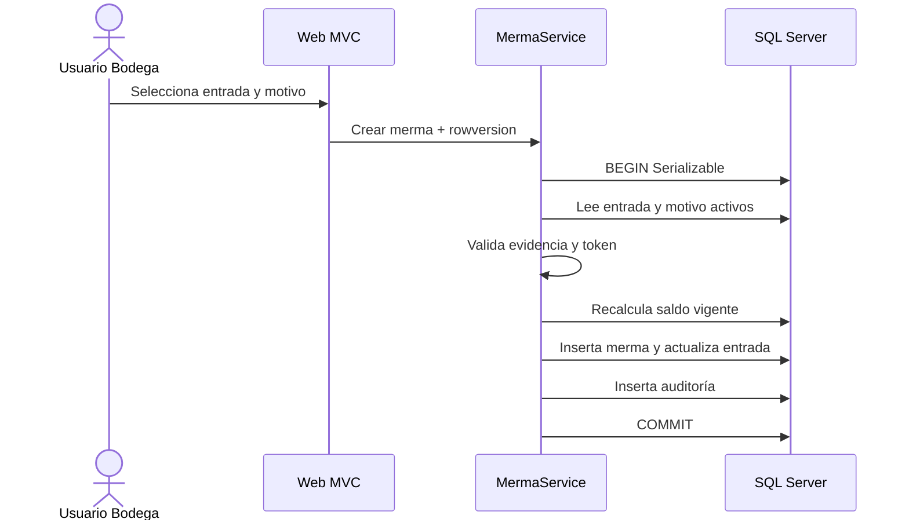
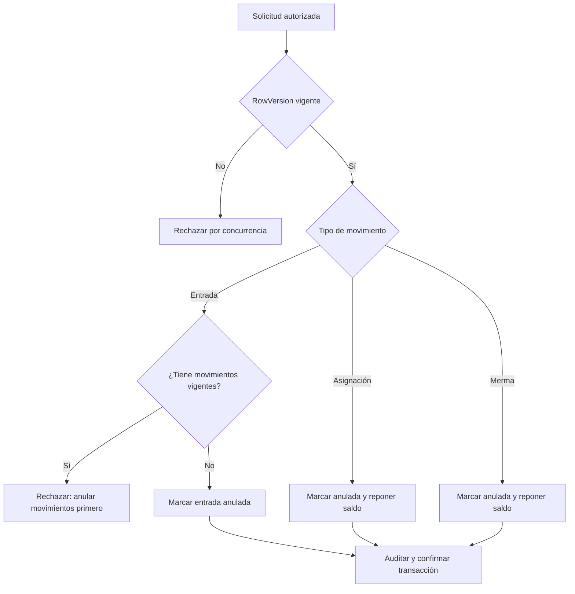

# Sprint 3: mermas, anulaciones e indicadores

## Objetivo

Registrar pérdidas asociadas a una entrada, exigir evidencia cuando corresponda, conservar el historial mediante anulaciones lógicas y entregar análisis agregado de causas.

## Flujo de merma



## Flujo de anulación



## Indicadores

La consulta agrupa exclusivamente mermas vigentes por motivo, tipo y unidad. Calcula cantidad, frecuencia, porcentaje sobre mermas, porcentaje sobre entradas y porcentaje acumulado para Pareto sin cargar entidades completas.

## Verificación

```powershell
dotnet tool run dotnet-ef migrations has-pending-model-changes `
  --project src/SistemaGestion.Infrastructure `
  --startup-project src/SistemaGestion.Web
dotnet build SistemaGestion.slnx
dotnet test SistemaGestion.slnx
dotnet run --project src/SistemaGestion.Web
```

